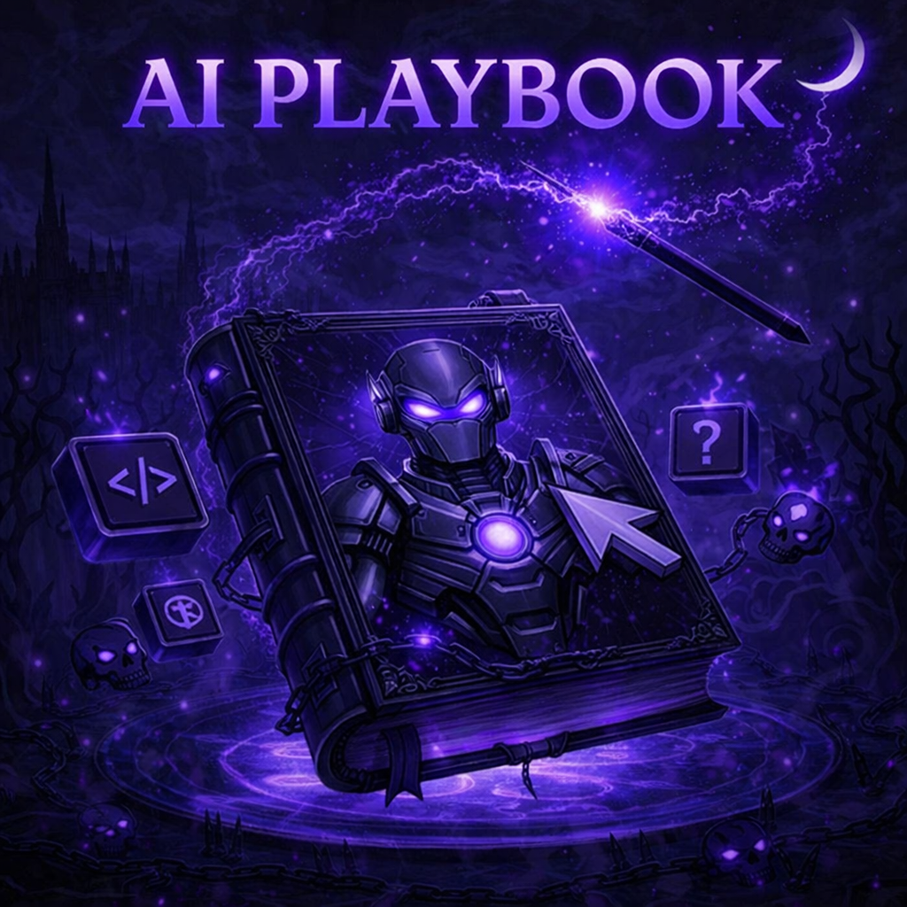

<div align="center">
  
</div>

# AI Playbook

This repository contains a **shared AI playbook** used across multiple projects to standardize how
AI assistants (Cursor, Claude, etc.) contribute to codebases.

It defines:

- Reusable **rules (`.mdc`)** — persistent behavior constraints
- Structured **AI commands** (`/start`, `/feature`, `/fix`, `/refactor`, etc.) — slash-triggered
  workflows
- **Agent skills** (`.agents/skills/`) — on-demand domain expertise (security review, conventional
  commits, release notes, etc.)
- Optional **setup bundles** (`.agents/setups/`) - pre-configured teams that install their own
  personas, commands, and setup-local skills for dev, legacy, PM/BA, web2, and web3 projects
- **Security-first policies** (MCP validation, backdoor prevention, supply-chain awareness)
- **Version and branch discipline** for AI-generated commits

For a detailed explanation of rules, commands, skills, setup bundles, and MCP, see
[CONCEPTS.md](CONCEPTS.md).

The goal is to ensure AI-assisted development is:

- **Consistent** across projects
- **Safe** by default
- **Auditable** and reviewable
- **Explicit in intent** (feature vs fix vs refactor)

For guidance on reducing LLM token usage (especially for shell commands and search), see
[TOKEN_OPTIMIZATION.md](TOKEN_OPTIMIZATION.md).

---

## Quick Start

Works for both **vibe coders** (just want results) and **developers** (want to customize).

### Mental Model First

Before choosing an install path, keep this distinction in mind:

- **Base playbook** = `.agents/rules/` + `.agents/commands/` + `.agents/skills/`
- **Setup bundle** = an optional package in `.agents/setups/` that installs its own personas,
  commands, and setup-local skills for one opinionated workflow
- **Skills are not an alternative to setups**. Skills are small expertise modules. Setups are larger
  workflow bundles that may include their own local skills.

**Most projects should start with the base playbook:**

```bash
git clone https://github.com/KaelSensei/ai-playbook.git .ai-playbook
npx ai-playbook-cli@latest install
```

**30-second install** — pick the setup that matches what you're building, then run one command:

```bash
git clone https://github.com/KaelSensei/ai-playbook.git .ai-playbook
bash .ai-playbook/.agents/setups/dev-squad-v2/install.sh
```

**Which setup should I pick?**

| If you are...                                         | Use                |
| ----------------------------------------------------- | ------------------ |
| Building a throwaway POC, demo, or weekend spike      | `poc-squad-v1`     |
| Building a web app, SaaS, or API (TypeScript / React) | `dev-squad-v2`     |
| Building a full-stack product with the works          | `web2-agents-v1`   |
| Building smart contracts / DeFi / on-chain apps       | `web3-agents-v3`   |
| Modernizing a legacy codebase                         | `legacy-agents-v1` |
| Writing specs, user stories, or doing product work    | `pm-ba-squad-v2`   |

If you do **not** need a prebuilt team with extra personas and setup-local commands, start with the
base playbook instead of a setup bundle. See
[CONCEPTS.md — Which setup for my situation?](CONCEPTS.md#which-setup-for-my-situation) for the full
decision table.

After install, open your project in Claude Code or Cursor and type `/start`. The AI reads your
project, picks a task, and begins. That's it — you're vibe coding with guardrails.

**Next steps:** read [Getting Started](#getting-started) below for the full command list, or
[CONCEPTS.md](CONCEPTS.md) if you want to understand how rules, commands, skills, and setup bundles
fit together.

---

## Why This Exists

Copy-pasting AI rules between projects does not scale and leads to:

- Silent behavior drift
- Inconsistent security guarantees
- Uncontrolled AI changes

This repository acts as a **single source of truth** for AI behavior and is meant to be included in
projects via **Git submodules or symlinks**.

Each project can pin a specific version of the playbook and upgrade intentionally.

---

## What This Repo Is (and Is Not)

**This repo is:**

- A reusable AI behavior baseline
- Tool-agnostic base playbook (rules, commands, skills work with Claude Code and Cursor). Setup
  bundles target Claude Code primarily — see
  [`.agents/docs/AGENTS_COMPATIBILITY.md`](.agents/docs/AGENTS_COMPATIBILITY.md)
- Security-focused and production-oriented

**This repo is NOT:**

- Project-specific documentation
- Application code
- A framework or SDK

---

## Base Playbook vs Setup Bundles

Use the **base playbook** when you want portable, reusable building blocks:

- Shared rules for behavior and safety
- Shared slash commands for common workflows
- Shared skills that commands can load on demand

Use a **setup bundle** when you want a pre-arranged team workflow for one project archetype:

- Agent personas
- Setup-local commands
- Setup-local skills
- Optional hooks and extra docs

Rule of thumb:

- If you are asking "what expertise should the AI load during a task?" -> **skill**
- If you are asking "what whole package should I install for this kind of project?" -> **setup
  bundle**

---

## Installation

### Option 1: Setup Bundle (Optional, More Opinionated)

**Install a pre-configured agent team into your project:**

Choose this when you want an opinionated bundle for one workflow. If you only want the shared rules,
commands, and skills, skip to **Option 2**.

```bash
# Clone the playbook
git clone https://github.com/YOUR_USERNAME/ai-playbook.git .ai-playbook

# Pick a setup and install (default target: .claude/)
bash .ai-playbook/.agents/setups/dev-squad-v2/install.sh

# Or target a different tool directory
bash .ai-playbook/.agents/setups/dev-squad-v2/install.sh .cursor
```

Available setup bundles:

| Setup              | Agents                   | Best for              | Claude Code | Cursor     |
| ------------------ | ------------------------ | --------------------- | ----------- | ---------- |
| `poc-squad-v1`     | 1 (prototyper)           | Throwaway POCs, demos | ✅ Full     | ✅ Full    |
| `dev-squad-v2`     | 3 (tech-lead, 2 seniors) | TypeScript/React TDD  | ✅ Full     | ⚠️ Partial |
| `pm-ba-squad-v2`   | 3 (PO, BA, reviewer)     | Specs, stories, BDD   | ✅ Full     | ⚠️ Partial |
| `legacy-agents-v1` | 14 (full team)           | Legacy modernization  | ✅ Full     | ⚠️ Partial |
| `web2-agents-v1`   | 13 (full team)           | Full-stack SaaS       | ✅ Full     | ⚠️ Partial |
| `web3-agents-v3`   | 10 (full team)           | Smart contracts, DeFi | ✅ Full     | ⚠️ Partial |

**Tool compatibility:** Setup bundles target Claude Code as their primary tool. On Cursor, the
commands and skills still work, but the sub-agent personas collapse into one and any shell hooks
(guardrails in `legacy-agents-v1`, `web2-agents-v1`, `web3-agents-v3`) are silently disabled because
Cursor has no hook system. Read
[`.agents/docs/AGENTS_COMPATIBILITY.md`](.agents/docs/AGENTS_COMPATIBILITY.md) for the honest
per-feature breakdown before picking a setup bundle.

See each setup bundle's README in `.agents/setups/` for details, or
[`.agents/setups/INSTALL.md`](.agents/setups/INSTALL.md) for the full walkthrough of installing a
bundle into a brand-new or existing GitHub repo (with commit/PR flow, updates, and troubleshooting).

### Option 2: Git Submodule (Base Playbook, Recommended for Most Projects)

**For the base rules, commands, and skills without multi-agent teams:**

```bash
git submodule add https://github.com/YOUR_USERNAME/ai-playbook.git .ai-playbook

# Symlink into your tool's config directory (.claude, .cursor, etc.)
mkdir -p .claude
ln -s ../.ai-playbook/.agents/rules .claude/rules
ln -s ../.ai-playbook/.agents/commands .claude/commands
ln -s ../.ai-playbook/.agents/skills .claude/skills
```

### Option 3: CLI Tool (Quick Setup for the Base Playbook)

```bash
npx ai-playbook-cli@latest install
```

See [INSTALLATION.md](INSTALLATION.md) for detailed setup and troubleshooting.

## Getting Started

After installing the base playbook or a setup bundle, open your project in your AI tool and start
using commands:

### 1. Bootstrap your session

```
/start
```

The AI loads your project docs, rules, and progress tracking, then picks up the next task and begins
working. Use this at the start of each new session.

### 2. Implement features and fixes

```
/feature add dark mode toggle
/fix image loading crash on Android
/refactor extract database utilities
```

Each command follows a full workflow: branch creation, implementation, validation, documentation
update, and commit+push.

### 3. Manage Git

```
/git                              # stage, commit, push (auto-generates message)
/create-branch                    # interactive branch creation
/create-pr dev                    # open PR from current branch into dev
/merge-branch-into-main           # safe merge with security review
/release 1.2.0                    # generate release notes + GitHub release
```

### 4. Quality and debugging

```
/audit-code src/                  # code quality + security audit
/magic-wand app crashes on start  # deep root-cause analysis
/cleanup-repo                     # reorganize scattered files
/clean-code src/utils/            # remove dead code and clutter
```

### 5. Resume after a break

```
/continue
```

The AI reloads progress, checks the current branch, and picks up where you left off.

### Skills (automatic)

Skills are **not invoked directly**. The AI loads them automatically when a matching task is
detected, or when a command references them (e.g. `/feature` uses the `security-review` and
`git-branch-naming` skills). Setup bundles may also ship **setup-local skills** inside the installed
tool directory; those belong to the setup bundle, not to the base playbook catalog. See
[CONCEPTS.md](CONCEPTS.md) for details.

---

## Typical Usage

- Install the **base playbook** for most projects, or add a **setup bundle** if you want a more
  opinionated team workflow
- Config lives in your tool's directory (`.claude/`, `.cursor/`, etc.)
- Read automatically by AI assistants
- Updated independently of application code

### Unattended / autonomous runs

If you want to kick off a task and walk away (e.g. from a dedicated machine while you are out), see
[AUTONOMOUS_SETUP.md](AUTONOMOUS_SETUP.md) for the safe setup flow and the `/auto` command shipped
in `dev-squad-v2`. The guide covers Claude Code, Codex CLI, Cursor, Gemini CLI, and Aider, plus a
one-shot bootstrap script at `scripts/setup-autonomous.sh`.

---

## Design Principles

- Security > correctness > performance > convenience
- Explicit intent over implicit behavior
- Minimal magic, maximal auditability
- AI should behave like a **senior engineer**, not an autocomplete engine

---

## Development

This repository uses ESLint and Prettier for code quality and formatting.

### Setup

```bash
# Install dependencies
npm install

# Format all files
npm run format

# Check formatting
npm run format:check

# Lint TypeScript code (CLI)
npm run lint

# Run all checks
npm run check
```

### Code Quality

- **ESLint**: TypeScript/JavaScript linting for the CLI tool
- **Prettier**: Code formatting for all files (Markdown, JSON, TypeScript, etc.)
- **Pre-commit hooks**: Automatically runs linting and formatting checks before each commit
  - Uses [Husky](https://typicode.github.io/husky/) for Git hooks
  - Uses [lint-staged](https://github.com/lint-staged/lint-staged) to check only staged files
  - Automatically fixes formatting issues when possible

---

## Versioning

The playbook follows [Semantic Versioning](https://semver.org/). Releases are cut as **git tags**
(e.g. `v0.2.0`) and listed on the
[GitHub Releases page](https://github.com/KaelSensei/ai-playbook/releases). Pin a specific tag in
your project's submodule or CLI install to freeze playbook behavior, and upgrade intentionally.

- **Playbook version** — git tags (`v0.2.0`, `v0.3.0`, …). Each tag has a matching CHANGELOG entry.
- **CLI version** — independent, published as `ai-playbook-cli` on npm. See
  [`cli/PUBLISH.md`](cli/PUBLISH.md).

All notable changes are documented in [CHANGELOG.md](CHANGELOG.md). The rubric for when a change is
MAJOR / MINOR / PATCH, the release process, and rollback rules live in [RELEASE.md](RELEASE.md).

While the playbook is below `1.0.0`, MINOR bumps may contain breaking changes — the shape of the
playbook is still evolving. Once it hits `1.0.0`, MAJOR bumps will be used strictly.

---

## CLI Commands

The AI Playbook includes a CLI tool for easy installation and management:

```bash
# Install in current project
npx ai-playbook-cli@latest install

# Check installation status
npx ai-playbook-cli@latest status

# Update playbook
npx ai-playbook-cli@latest update
```

See [cli/README.md](cli/README.md) for full CLI documentation.

For installation, deployment, and next steps, see [INSTALLATION.md](INSTALLATION.md).

## Resources

### Official Documentation

- **[Cursor Commands Documentation](https://cursor.com/docs/context/commands)** - Official Cursor
  documentation on creating and using custom commands
  - Learn how commands work
  - Understand command structure and syntax
  - See examples of effective commands

### Multi-agent Playbook Usage

- **[CONCEPTS.md](CONCEPTS.md)** – core model for rules, commands, skills, and MCP
- **[.agents/docs/AGENTS_COMPATIBILITY.md](.agents/docs/AGENTS_COMPATIBILITY.md)** – how to reuse
  this playbook with different AI tools

### Community Examples

- **[cursor-commands Repository](https://github.com/hamzafer/cursor-commands/tree/main/.agents/commands)** -
  Community-maintained collection of Cursor command examples
  - Real-world command implementations
  - Additional command patterns and workflows
  - Inspiration for creating your own commands

- **[AIBlueprint](https://github.com/Melvynx/aiblueprint)** - Similar CLI tool for Claude Code
  configurations
  - Inspiration for CLI structure
  - Example of npx-based installation

- **[TOKEN_OPTIMIZATION.md](TOKEN_OPTIMIZATION.md)** - Practical guide to reducing token usage with
  RTK (Rust Token Killer) and playbook-level token hygiene.

---

## Annex – Commands & Skills

For a consolidated overview of all available Cursor commands in this playbook, see:

- [COMMANDS.md](COMMANDS.md) – summary table of every `/command` and its purpose

For the agent skills bundled with this playbook, see:

- [CONCEPTS.md](CONCEPTS.md) – explains rules, commands, skills, and MCP
- `.agents/skills/` – skill files the AI loads on demand

---

## Contributing

Contributions are welcome — new rules, commands, skills, setups, bug fixes, and docs improvements.

Start with [CONTRIBUTING.md](CONTRIBUTING.md) for the workflow, branch conventions, and quality bar.
If you're reporting a security issue, use the private channel described in
[SECURITY.md](SECURITY.md) — do not open a public issue.

---

## License

This project is free to use and reuse for any purpose, including commercial use.  
You are free to:

- Use this playbook in your projects (commercial or non-commercial)
- Modify and adapt it to your needs
- Share it with others
- Include it in proprietary software

No attribution required, though it's appreciated.
